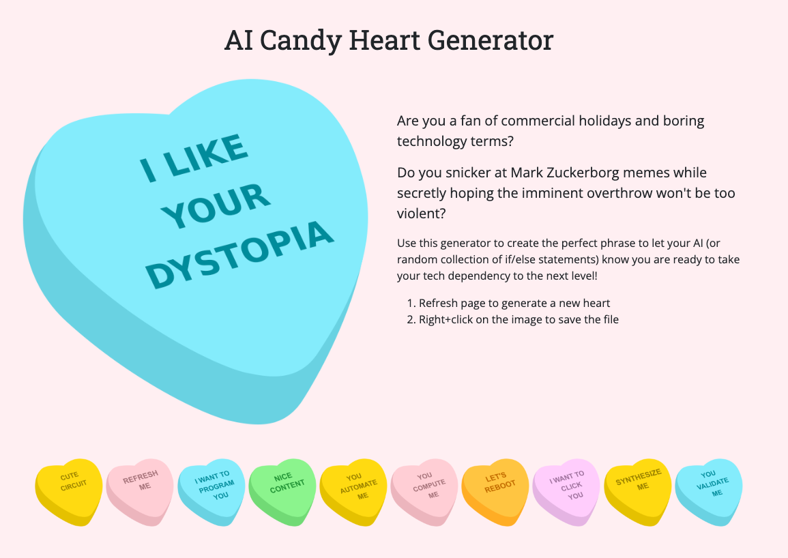

# AI Candy Heart Generator


 

<!--          -->


Running on Vercel @ https://ai-candy-hearts-api.vercel.app/

Endpoints 
- Home http://localhost:3000/ 
- Text http://localhost:3000/api/random
- SVG http://localhost:3000/api/heart.svg
- PNG http://localhost:3000/api/heart.png


## Tutorial*

*From scratch, or just clone the repo

### 1. Generate project

```bash
# generate project
npx express-generator --view=hbs sample-api-candy-hearts
# change directory
cd sample-api-candy-hearts
# open in VS Code
code .
# install modules
npm install
# run the app
DEBUG=sample-api-candy-hearts:* nodemon start
```


### 2. Modify structure

1. Move and rename `/bin/www.js` to `/server.js`
1. Update paths in `server.js`, add `module.exports = server` to the end
1. Update `package.json` to reflect these changes 


### 3. Add Bootstrap to views

1. Add Bootstrap to `views/layout.hbs` using their [quickstart](https://getbootstrap.com/docs/5.3/getting-started/introduction/#quick-start)
1. Delete content inside `public/stylesheets/style.css`


### 4. Create API

1. Replace all occurances of the word "users" with "api" across the whole project (Command+Shift+F) including the filename of `routes/users.js`
1. Open `routes/api.js` and replace line 6 `res.send(...)` with `res.json({ "message": "hello, world!" });` 
1. Got to http://localhost:3000/api to test


### 5. Track with Git

[.gitignore](https://www.toptal.com/developers/gitignore/api/node,macos,windows)

```bash
# add .gitignore, paste from link above
touch .gitignore
# make a git repo
git init
# first commit
git add .
git commit -m "First commit"
```


### 6. Publish

1. Add a `vercel.json` file with the contents below
1. Commit and push all your changes to Github
1. Create vercel.com account (using Github)
1. Add Project
1. Import your repository
1. Click Deploy

```json
{
	"version": 2,
	"name": "sample-api-candy-hearts",
	"builds": [{
		"src": "./server.js",
		"use": "@vercel/node"
	}],
	"routes": [{
		"src": "/(.*)",
		"dest": "/server.js"
	}]
}
```

### Debugging Vercel

Use the [Vercel CLI](https://vercel.com/docs/cli) to view [logs](https://vercel.com/docs/cli/logs) or [inspect](https://vercel.com/docs/cli/inspect) your app

```bash
# install Vercel CLI 
npm i -g vercel
# check version
vercel --version
# view logs (login as needed)
vercel logs ai-candy-hearts-api.vercel.app
```


## Next Steps

At this point you have the basic API running on Vercel. See these files to finish implementing this API:

- `routes/api.js`
- `app/functions.js`
- `app/words.js`


## References

- [How to create and deploy an Express.js app to Vercel](https://syntackle.live/blog/how-to-create-and-deploy-an-express-js-app-to-vercel-ljgvGrsCH7ioHsAxuw3G/) May 2022
- [How To Process Images in Node.js with Sharp](https://www.digitalocean.com/community/tutorials/how-to-process-images-in-node-js-with-sharp) September 2021
